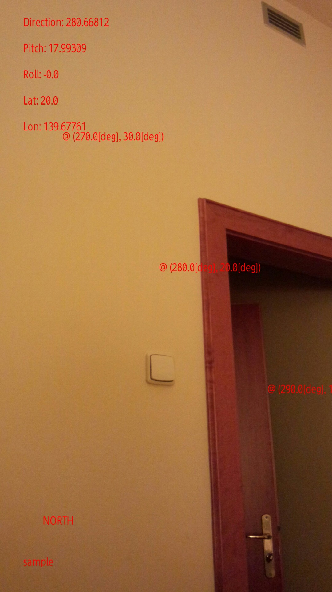
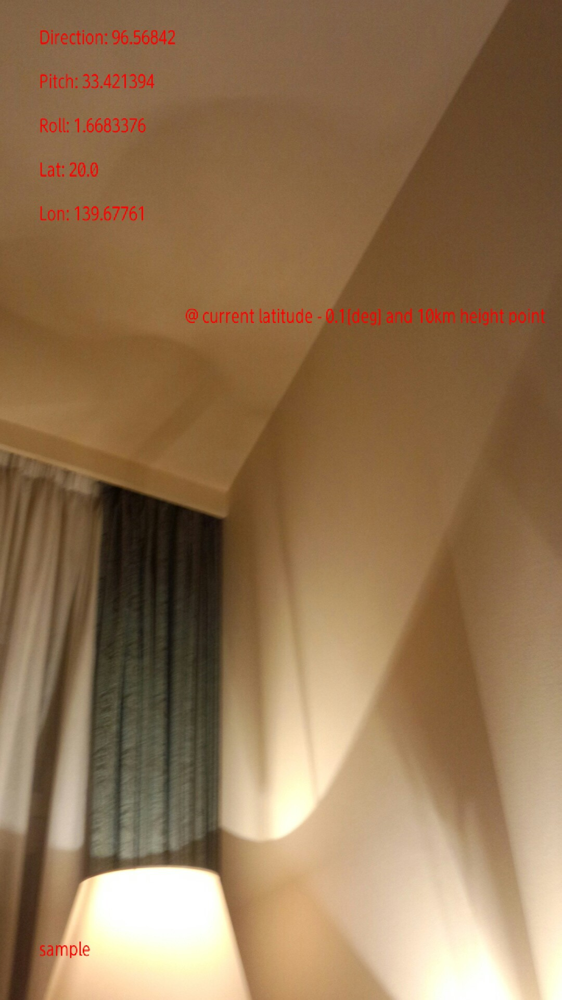
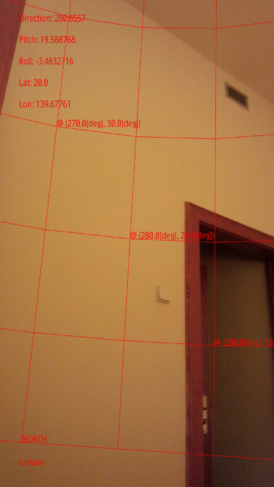
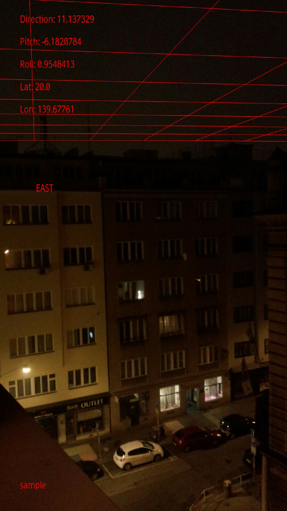

======
SiLBALA: Simple Location Based AR Library for Android

Usage
------
+ copy the src folder of the package org.braincopy.silbala to your src folder.
+ create your Activity and ARView class, referring SampleMainActivity and SampleARView of samples package.

Functions
------
+ simple sample AR application for android
+ get x, y on the display screen of android device from azimuth and elevation information of target.

+ get x, y on the display screen of android device from latitude, longitude, and altitude of target.

+ draw azimuth and elevation lines

+ draw a kind of roof of latitude and longitude grid.

Theory!?
------

###How to calculate the position on a display screen of a smart-phone

Basically ARView class has a method to calculate the point of intersection between the plate of display screen ant the line from user to target object.

###Coordinates

In this library, two kinds of coordinates are used.

(1) real world coordinate:

* right-handed coordinate system
* x axis is south direction,
* y axis is down direction,
* z axis is east direction,
* angle increases for clockwise for all axis
* original point (0, 0, 0) means the position of android device user.

(2) display screen coordinate:

 * right-handed coordinate system</li>
 * when the camera directs east without any lean and incline, azimuth, pitch, and roll will be 0 (zero).
 * x axis is direction of moving,
 * y axis is horizontal right direction,
 * z axis is vertical down direction,
 * angle increases for clockwise for all axis. The coordinate system should be adjusted for each devices,
 * original point (0, 0, 0) means the point of above left corner of the display screen of the android device.

License
------

Copyright (c) 2013 braincopy.org

Permission is hereby granted, free of charge, to any person obtaining a copy 
of this software and associated documentation files (the "Software"), to deal
in the Software without restriction, including without limitation the rights
to use, copy, modify, merge, publish, distribute, sublicense, and/or sell 
copies of the Software, and to permit persons to whom the Software is furnished
to do so, subject to the following conditions:

The above copyright notice and this permission notice shall be included in all 
copies or substantial portions of the Software.

THE SOFTWARE IS PROVIDED "AS IS", WITHOUT WARRANTY OF ANY KIND, EXPRESS OR 
IMPLIED, INCLUDING BUT NOT LIMITED TO THE WARRANTIES OF MERCHANTABILITY, 
FITNESS FOR A PARTICULAR PURPOSE AND NONINFRINGEMENT. IN NO EVENT SHALL 
THE AUTHORS OR COPYRIGHT HOLDERS BE LIABLE FOR ANY CLAIM, DAMAGES OR OTHER 
LIABILITY, WHETHER IN AN ACTION OF CONTRACT, TORT OR OTHERWISE, ARISING FROM, 
OUT OF OR IN CONNECTION WITH THE SOFTWARE OR THE USE OR OTHER DEALINGS 
IN THE SOFTWARE.

